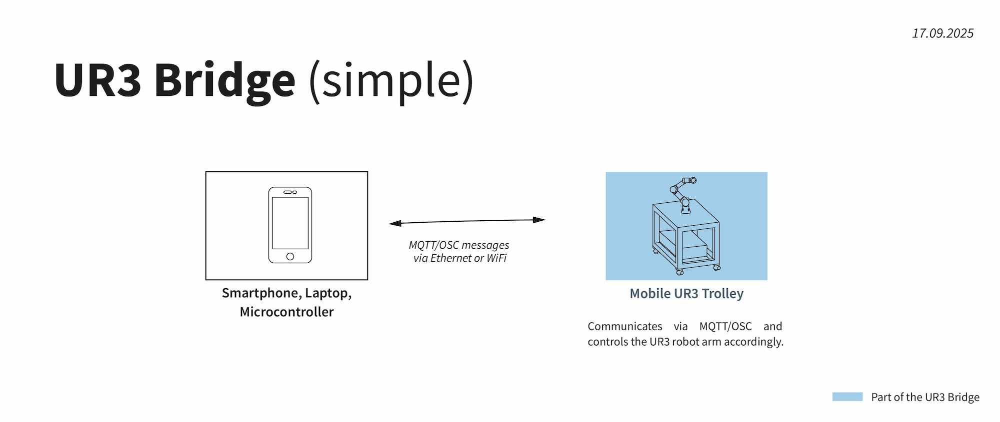

# UR3 Bridge

This file is the **entrance point to the documentation**. Read it first and then check out the more specific files linked directly below. 

**Looking for the Credentials for the UR3 Bridge at KISD?** Find them in the UR3 Trolley!

## Documentation Overview
- [All Commands one can "set" with this Bridge](docu/set-commands.md)
- [Technical Details and Network Setup](docu/technical-details.md)
- [Ur3 Trolley and Startup Procedure](docu/ur3-notes.md)
- [Notes on the Performance of the Bridge](docu/performance-notes.md)
- [Example Applications](docu/examples.md)

**Install and Config**

If you wan to set up the bridge with your own UR3 there are some things to do:

1. [Set up a Raspberry Pi](https://github.com/jakobkilian/raspi-setup) with my general instructions to have it accessible via Wi-Fi and Ethernet and other things
2. Follow the [install instructions](docu/install-bridge.md) step by step to install and run the bridge on this Raspi
3. Load the [urp script](src/urscript/mqtt-ur3-bridge-main.urp) file to your UR3 in order to connect it to the bridge

## Motivation & Background

### So, why all this? The UR3 in Creative Applications

Controlling a [Universal Robots UR3](https://www.universal-robots.com/de/produkte/ur3e/) is far from trivial, especially when it comes to performing smooth, real-time movements based on sensor input. In addition to the inherent complexity of programming crash-free 3D movement UR lacks proper documentation and sometimes provides buggy installers. 

**I want to share my experiences with the UR3 in creative applications and provide a solution to problems that I had. The UR3 Bridge, an interface to control the UR3 with MQTT or OSC from anywhere.**

*These notes were made as part of my work at [KISD](http://kisd.de/), Cologne, and refer to the UR3 model that was available in my lab there.*

### The Challenge: Fluent Movement via Network

This is a spoiler on what I wanted to achieve but had problems with. Looks simple, wasn't that easy though.
**Why are fluent movements on the UR3 so hard to achieve?** 
<details>

<summary>read more...</summary>

In most industry-standard applications for robots of this type, the start and end points of movements and their timing are known. Depending on the application, commands such as movej or movel are used, which allow the arm to be moved with parameters such as _time, acceleration, maximum speeds, and interpolating blends between points_. The principle is always the same: start at A, accelerate according to the parameters, slow down, and stop at point B. However, if the robot is supposed to follow a hand gesture or move along vector paths in a smooth, uninterrupted motion, it becomes more tricky: sending many individual points would cause it to stop at each one. We need to use the servoj to acheive this and send new points at a rate sufficient to not hear or see the "frames". 

I will add some more details on my experiments (which network hardware, which framerate etc) later.

</details>

You might ask, why we need just another interface to achieve this. It is pretty much the need for universality and simplicity that motivated me to do this:

https://github.com/user-attachments/assets/cf530003-c5e4-409b-82cf-cb6f08d3dad7


**Why another interface for the UR3?**
<details>
<summary>read more...</summary>

UR offers a [bunch of possibilities to interface with the UR3](https://www.universal-robots.com/articles/ur/interface-communication/overview-of-client-interfaces/). I looked through this list, but they all had drawbacks in terms of compatibility and universality. E.g. "RTDE" required installations on the client side – some having issues about the installation which haven't been solved for years at the time. On top connecting to UR controller by default only works with Ethernet and fix IP addresses. Having e.g. microcontrollers in a WiFi network to control the robot would be tricky in this setup. So I wondered why there wasn't a easy-to-use universal interface that could be used to remotely control the robot from any programming language and any device via network. That's why I build a OSC/MQTT bridge to control the robot from within e.g. python, MaxMSP, Processing or others on any device in a network (Ethernet/WiFi) set up by an additional intermediate Raspberry Pi. This worked very well for my use cases and can hopefully be rebuild by following the instructions in the repository.

</details>

## How does it work?

The UR3 Bridge lets you to control a Universal Robot UR3 over a local Ethernet **or** WiFi using simple commands over **OSC or MQTT**. It can therefore be used with any client (Smartphone, Laptop, Microcontroller) and with any application without installing software:  e.g. Python, C++, Arduino, Processing, MaxMSP, PureData, VVVV, TouchDesigner



## General Usage

Send and receive **MQTT/OSC messages** to a Raspberry Pi running the UR3 Bridge (called **URPi**) using either its fixed IP address or its hostname in any network it is connected to. Monitor and control the UR3 robot remotely.

---

The **URPi** includes:

- **Raspberry Pi** with specific configurations and network services running
- **MQTT broker** "mosquitto" running 
- **ur3-bridge.py** script relaying incoming commands to UR3 via TCP socket

---

The **UR3** (more precise: the UR3 controller) runs a custom URScript (**ur3-bridge-main.urp**) that processes the incoming TCP commands to actually move the robotic arm. The URScript is started by using the interfacing tablet called "Teach Pendant".

---

This results in the following overview chart with the UR3 Bridge parts in **blue**:


## How the Interface works

The UR3 Bridge interface syntax is oriented at the official [URScript syntax](https://www.universal-robots.com/developer/urscript/) but differs in some cases.

A message to the UR3 bridge always consists of a topic and a payload, e.g.:

```
topic: "ur3/set/cmd"
payload: getPose
```

### MQTT vs OSC

*The project started with MQTT only. As all messages go through a central "broker" one can  monitor all communication and use multiple clients to send messages. However, MQTT is not implemented into many programming languages and applications as natively as OSC. Therefore the bridge now supports **both**: MQTT and OSC*

#### MQTT

In MQTT the "topic" corresponds to the MQTT topic.

With MQTT simply send messages to the URPi (see Network Setup below)

#### OSC

**In OSC** the "topic" corresponds to the OSC address.In order to connect with OSC use **port 8000** and send `/ur3/connect [your_ip]` in order to register your machine at the Bridge.

### Topic

#### Available Sending Topics

- `ur3/set/cmd`: Remotely set commands or settings on the UR3 
- `urpi`: change settings of the UR3 Bridge

#### Available Receiving Topics

- `ur3/get/val`: Here the UR3 Bridge returns requested values
- `ur3/status`: current status of UR3 Bridge and UR3
- `ur3/isOnline`: Periodical online flag
- `ur3/return` (only MQTT): returns from commands/requests
- `ur3/debug` (only MQTT): Detailed debug information

### Payload

The payload is formatted as ASCII string. 

**The most important topic is "ur3/set/cmd".** [Find all Set-Commands here](docu/set-commands.md).
This is an example in the OSC format:

````
topic: /ur3/set/cmd 
payload: "pose:0.2142, -0.30, 0.01, -1.07, 1.03, -1.27"
````

**The second possible topic is "urpi"** with currently only one command, that pulls the URScript folder and pushes it to GitHub (only for dev reasons)

````
topic: urpi
payload: backup
````

